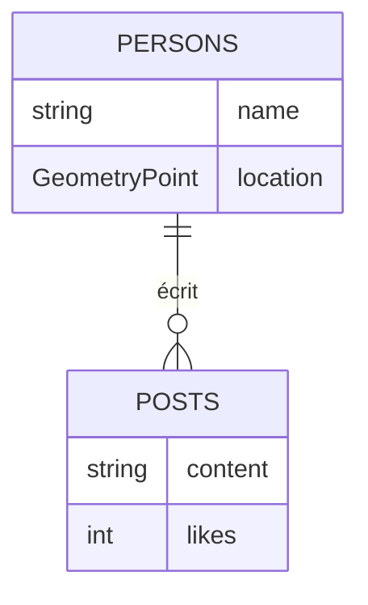

# 🚀 SocialApp avec SurrealDB (Go)

Un exemple d'application sociale utilisant **SurrealDB** (base de données orientée graphe + géospatiale) avec le driver Go officiel.
Démonstration de relations utilisateurs, posts, requêtes temps réel et géolocalisation.

## ✨ Fonctionnalités
- ✅ **Gestion d'utilisateurs** avec géolocalisation (coordonnées GPS)
- 🤝 **Relations d'amitié** (graphes)
- 📝 **Posts** avec likes et auteurs
- 🌍 **Recherche géospatiale** (distance entre utilisateurs)
- ⚡ **Mises à jour temps réel** (via `LIVE SELECT`)
- 🔍 **Requêtes complexes** combinant graphes + géodonnées

## 📦 Prérequis
- Go 1.20+
- SurrealDB (en local ou Docker)
```bash
docker run --rm -p 8000:8000 surrealdb/surrealdb:latest start --log trace --user root --pass root

### Installation
Cloner le dépôt :

```bash
git clone https://github.com/ArthurLewyin12/go-surrealdb.git
cd go-surrealdb
```

### Installer les dépendances :

```bash
go get github.com/surrealdb/surrealdb.go
```

### Lancer l'application :

```bash
go run main.go
```

## 📊 Diagramme de données


